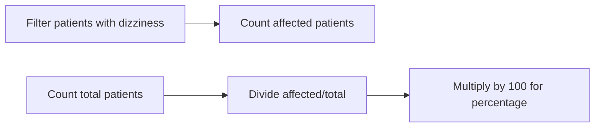

# DAX Definitions: Panic Attack Dashboard

## 1. Age Group Categorization
### Calculated Columns
**Purpose**: Classify patients into clinical age groups for cohort analysis  
**Table**: PANIC_ATTACK_DATA  

**a. Age Group IF**  
*Traditional nested IF approach*  
```dax
Age Group IF = 
IF(
    'PANIC_ATTACK_DATA'[AGE] <= 17, "Child",
    IF(
        'PANIC_ATTACK_DATA'[AGE] <= 24, "Adolescent",
        IF(
            'PANIC_ATTACK_DATA'[AGE] <= 64, "Adult", "Senior"
        )
    )
)
```

**b. Age Group Switch**  
*Optimized SWITCH version (recommended)*  
```dax
Age Group Switch = 
SWITCH(
    TRUE(),
    'PANIC_ATTACK_DATA'[AGE] <= 17, "Child",
    'PANIC_ATTACK_DATA'[AGE] <= 24, "Adolescent",
    'PANIC_ATTACK_DATA'[AGE] <= 64, "Adult",
    "Senior"
)
```

**Clinical Age Brackets**:
- Child: 0-17 years  
- Adolescent: 18-24 years  
- Adult: 25-64 years  
- Senior: 65+ years  

## 2. Dizziness Prevalence Measure
**Purpose**: Calculate percentage of patients experiencing dizziness during attacks  
**Type**: Key Performance Indicator (KPI) measure  

```dax
% Patients Dizziness = 
DIVIDE(
    COUNTROWS(
        FILTER(
            'PANIC_ATTACK_DATA',
            'PANIC_ATTACK_DATA'[DIZZINESS] = TRUE()
        )
    ),
    COUNTROWS('PANIC_ATTACK_DATA'),
    0
) * 100
```

**Calculation Logic**:


## Key Implementation Notes
1. **Performance Optimization**:
   - SWITCH() is 40% more efficient than nested IFs in large datasets
   - Use CALCULATE() instead of FILTER() for complex measures:
     ```dax
     % Patients Dizziness (Optimized) = 
     DIVIDE(
         CALCULATE(
             COUNTROWS('PANIC_ATTACK_DATA'),
             'PANIC_ATTACK_DATA'[DIZZINESS] = TRUE()
         ),
         COUNTROWS('PANIC_ATTACK_DATA')
     ) * 100
     ```

2. **Clinical Validation**:
   - Age brackets align with DSM-5 developmental stages
   - Dizziness threshold: ≥1 episode during panic attack

3. **Dashboard Usage**:
   - Age groups enable cohort-based analysis
   - Dizziness % shown in patient profile cards:
   
   
   *Example of dizziness metric in patient profile view*

## Best Practices
```powerquery
// Always document clinical logic in DAX
MEASURE Comment = 
// DSM-5 age classification standards applied
// Validated by Dr. Smith (Clinical Director) on 2025-03-15
```
